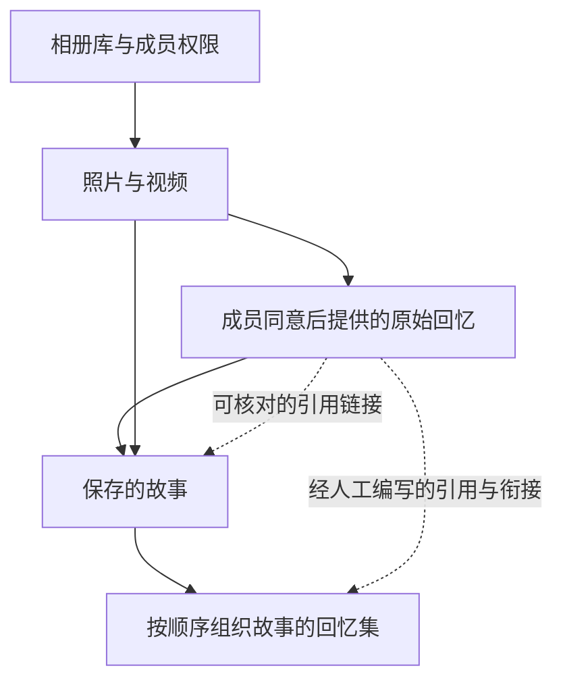

# 故事与回忆体验

本文描述产品中的内容层级、各客户端职责和后续体验方向。它是产品设计说明，不代表某项服务已在家庭环境启用。关于模块边界、留存和开发验收，请参阅[架构](ARCHITECTURE.md)、[功能与验收矩阵](FEATURES.md)和[开发说明](DEVELOPMENT.md)。

## 内容如何串联

- **相册库**先决定谁可以查看或编辑。相册库成员权限是媒体、回忆和故事的共同边界。
- **照片和视频**是故事选择的画面。记录日期、文件名日期和收到日期含义不同，不能互相当作拍摄证明。
- **原始回忆**由家庭成员以文字或录音提供。接受和处理同意决定是否可用于相应流程。原文、原录音、转写、润色文字和标签分别保存；已建立的章节链接不会改写或删除原件。家庭原始录音保留至相册库主人执行删除。
- **保存的故事**由有序章节、章节文字、选定画面和当前可核对的来源组成。成员可以在有权限的范围内编辑；引用用于说明资料来源，不等于事实已经核实。
- **回忆集（memoir）**按顺序组织已保存的故事。服务端可选的 b1 手工编辑侧车默认关闭；启用后可保存开篇引用、相邻故事之间的衔接文字和对应来源。它不改写旧的回忆集响应，也不会自动补齐历史引用。故事版本或来源变化时，侧车会报告来源已变化，旧衔接不应继续显示为当前内容。

### 从一组画面开始

Web 和手机源码已有受保护的组故事入口：在同一个相册库中选择最多 24 张照片或
视频，排列章节、检查引用，再明确保存。手机的可选署名来自当前资料，不需要 AI 猜测
家人的身份。用户可以修改或留空；贡献的账号归属仍由服务器记录。

“同一天的更多瞬间”只使用已记录的拍摄日期，查询和加入都需要明确操作。
同日不代表同一活动；文件名日期或收到日期不会被当作拍摄证明。标题建议有独立、
默认关闭的模型入口，采用建议也不会自动保存。相关流程、容量和安装门槛见
[组故事架构](../clients/android/docs/GROUPED_STORY_CREATION_ARCHITECTURE_2026-10-09.md)
与[同日候选合同](../server/docs/security/STORY_RELATED_MEDIA_V1.md)。

## 客户端分工

- **手机**适合捕捉家庭回忆和语音输入。录音由用户主动开始、结束和检查；识别文字由用户检查后再提交。手机源码已有故事来源查看、链接和人工回忆册编排：为开篇选择回忆引用，给相邻故事写衔接并选择来源。编辑区默认折叠，各段可独立展开；保存结果不确定时显式重试同一请求。该流程已通过合成模拟器与大字号检查，尚未发布新签名 APK，也不代表 b1 服务已启用。章节重编排与录音剪辑仍需单独实现与验收。
- **Web**适合挑选画面、编辑故事章节和人工整理回忆集。回忆集编辑和阅读已通过合成数据浏览器旅程；服务端接口或源代码存在不代表 Web、迁移和运行环境已经启用。
- **TV**适合家庭共同观看大屏内容。现有 TV 客户端以明确选择相册库、遥控导航和有节奏的播放为主。私有故事和录音不会自动进入匿名电视目录；回忆集在 TV 上的阅读和发布要经过独立的授权、产品集成和设备验收。

## 语音边界

### 回到之前选择的对话

故事和整本回忆录分别记住本次运行期间选中的对话。重新打开时，客户端先读取
当前有权限查看的对话列表与消息，再提示“已回到上次选择的对话”。输入框保持
为空，不自动录音、创建对话或重发消息。最多保留 16 条仅用于导航的标识；账号、
成员版本、故事版本或回忆录篇章顺序变化后不沿用旧选择。关闭客户端后这些标识
不会保留。详见[对话导航与边界](CONVERSATION_NAVIGATION.md)。

当前有效的澄清回复会说明“AI 想再了解一点”。用户可以自己补充，也可以选择
建议问题作为可编辑草稿；已有草稿不会被替换，选择后不自动发送或录音。
源码与大字号验证见[澄清体验](CONVERSATION_CLARIFICATION.md)。Web 通用搜索助手另有
[本页最近对话](ASSISTANT_TURN_TRAIL.md)，不与故事、回忆集的服务端对话留存混为一谈。

### 录音、提交与播放

采集、转写、提交命令和播放是分开的用户动作。受保护的服务端检查身份和相册库权限，管理助手上下文、允许的意图、回执与处理状态。助手录音仅临时处理；文本、已提交命令和状态回执按接口约定保留 30 天。家庭成员提交的原始录音属于另一类家庭资料，保留至主人删除。

章节朗读可使用浏览器语音合成或 Android 的本机 TTS，并由用户显式控制播放；能否朗读取决于客户端安装的语音。故事与回忆册的助手回复也可由客户端本机 TTS 明确朗读；通用语音助手另外保留独立的服务端语音接口。源代码包含这些路径，不代表当前语音模型、Windows 运行时或音质已完成新的现场验证。故事生成默认关闭；启用前还需要独立的模型资格验证和人工审核。

## 已有的整理与阅读源码

Web 和手机均可先输入或口述整理要求，停止后编辑转写，再明确加入要求；
加入文字不会自动提交对话或生成。两端提供默认整理、忠实纪事、家庭散文和
长篇回忆录选项。这些是本次请求中的写作方向，不新增事实或放宽上下文上限。
默认请求保持兼容，联合 UTF-8 上限与不确定结果的固定重试保护完整草稿。

整本生成前先读取已保存故事的结构计划。已选择的开篇与衔接需明确加入，
每次重新核对当前来源和版本。Web 和手机的逐故事计划可在当前回忆集中阅读原故事，保留
未发送的要求和文体选择。整本超限时仍可阅读单篇；手机选中后收起容量计划，
将原文滚动到视线内。Web 和手机的建议目录默认折叠，保留展开标记，支持原有故事/章节标签和直接跳至
24 篇章中的任意一篇；跳章停止之前的朗读。Web 建议篇章也可明确朗读、暂停、继续和停止；使用本机语音，换章会停止上一段，不会自动播放下一章。AI 建议始终标为待核对内容，
原故事导航位于原文旁，避免两个篇章计数混淆。

这些路径已有合成浏览器或模拟器证据。整理 worker 的默认开关、Windows
原生资格、签名 APK、现场麦克风和实际模型质量需要分别验收。未保存的建议有
留存期限；源码另有默认关闭的 C2 审阅成稿保存、重新阅读和来源检查流程，采用前
仍需用户审阅。它绑定当前故事与来源，来源变化后不继续展示旧正文，不意味着原始
资料可以随成稿一起删除。详见[审阅成稿合同](../server/docs/security/REVIEWED_MEMOIR_EDITIONS_V1.md)。
Windows 迁移、删除与配对恢复资格、开关启用和家庭验收仍待完成，自动跨篇协调
仍未交付。

## 后续体验阶段

以下是计划方向，不是已交付功能：

1. **自然澄清与连续对话交付**：现有源码已提供当前回复的澄清提示、显式草稿插入和回执恢复。下一步交付并验证真实家庭对话与模型质量；连续说话仍须由用户控制录音。
2. **Android 编辑交付与原声体验**：先完成已有人工编排的 Windows b1 离线验证、上线和签名发布；再完善章节和录音编辑、来源原文核对与家庭验收。
3. **相册级提纲**：先排列画面并生成待审提纲，由相册库主人确认结构和来源后，再决定是否编辑或保存文字。
4. **长篇阅读**：改善跨故事连续播放、章节导航和来源核对；保持家庭原文与编辑衔接分开呈现。

“散文”或“小说式”可以用来讨论长篇呈现的节奏和阅读深度；当前整理入口支持纪事、散文和长篇回忆录的请求方向；“小说式”仍是设计用语，不代表新增虚构体裁、无限上下文或已启用的自动写作能力。示例衔接文字用于说明界面，不应被当作任何家庭的真实回忆。

## 如何理解验收

服务端合同测试、Web 合成数据浏览器测试、Android 模拟器、已安装客户端、家庭运行环境和真实家庭审核是不同证据。每项功能应在[功能与验收矩阵](FEATURES.md)中分别记录已实现部分和仍需通过的门槛；本地源代码或合成测试不能代替服务启用、家庭数据验证或实体设备验收。
