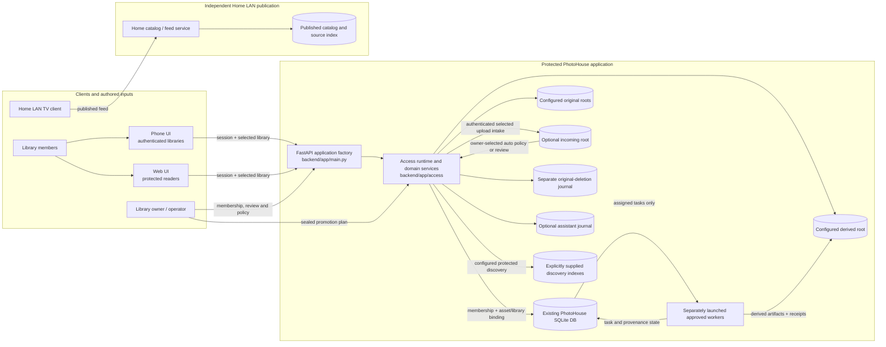
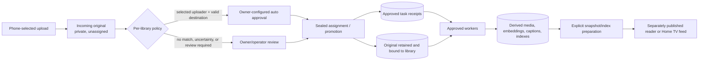
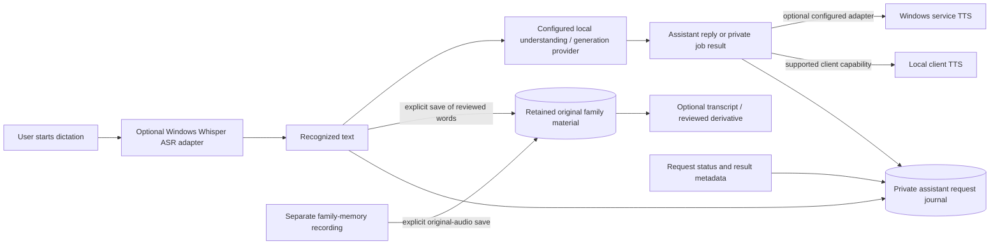

# PhotoHouse architecture — 2026-10-07

**Evidence scope:** Web and phone source pins, imported file blobs, and
candidate verification are recorded in the [source import ledger](../feature-source-changes.json).
The Web UI is under `server/backend/app/ui/access/` in this candidate. This page describes implementation and explicit configuration boundaries.
It does not assert that a Windows service, model, GPU, database migration,
scheduled task, index publication, signed package, or household device is
currently available or accepted.

The February architecture and earlier topic snapshots are historical material
outside this curated candidate. Provider/model lists, hardware assignments,
operational commands and status need fresh source or host evidence before reuse.

## System view

The repository contains a legacy application surface alongside the newer,
explicitly configured protected application and separate Home LAN services.
The diagrams show source ownership and data paths, not a promise that all
components are launched together. Backend code paths inside diagrams are
relative to the service root; the curated candidate keeps that root under
`server/`.

The Home catalog/feed path is a separately published LAN surface. Its
catalog/export tools and `server/backend/app/home_catalog.py` do not grant access to
protected library routes. An item appearing in a TV publication is not evidence
that a caller has protected phone or library access.

## Protected access and composition

`RuntimeConfiguration.build_app()` is the explicit composition point. It binds
a directly selected existing database, original and derived roots, optional
incoming storage, optional validated discovery-index paths, feature booleans,
and separately selected journals. It does not discover deployment settings or
silently bootstrap/migrate storage. The default code shell can be created
without those connections; protected routes fail closed when their runtime
dependency is absent. See [`runtime.py`](../../server/backend/app/access/runtime.py),
[`main.py`](../../server/backend/app/main.py), and
[`transport.py`](../../server/backend/app/access/transport.py).

Protected phone/Web operations use an active account session and an approved,
current membership in the selected active library. Asset operations additionally
resolve the asset's library binding; a library ID by itself does not make an
unbound or foreign asset visible. Owner actions require the owner role, and
operator actions use their separate scoped grant. Route adapters apply the
authorization boundary before media, story, upload, annotation, or memoir data
is returned. See [`service.py`](../../server/backend/app/access/service.py),
[`media.py`](../../server/backend/app/access/media.py), and
[`boundary.py`](../../server/backend/app/access/boundary.py).

The Home TV feed is an intentional exception with its own explicit publication
and allowlisted media service. It is not an anonymous tunnel into protected API
routes, and a successful LAN fetch says nothing about protected membership.

## Upload, approval, processing, and publication

An upload first lands in the configured incoming area and remains unassigned.
It is not servable as a library original merely because intake succeeded. The
owner may configure auto-approval for selected uploaders within a particular
library. The destination and policy are checked as part of assignment; uncertain
or stale policy/destination state stays private and requires review. Manual
review uses a sealed promotion plan. Successful promotion records the upload
receipt and asset-to-library binding before approved processing can act on the
asset. See [`upload.py`](../../server/backend/app/access/upload.py),
[`upload_review.py`](../../server/backend/app/access/upload_review.py),
[`promotion.py`](../../server/backend/app/access/promotion.py), and
[`upload_schema.py`](../../server/backend/app/access/upload_schema.py).

Approved workers are separate processes with task-specific allowlists and
preflights. They must find an assigned upload, active library binding, valid
original under the configured originals root, and an approved task before
processing. Workers write derived artifacts and task receipts; they do not
change who may access the source asset. Examples include the
[approved face worker](../../server/scripts/run_approved_face_worker.py),
[approved image worker](../../server/scripts/run_approved_image_embed_worker.py), and
[approved video worker](../../server/scripts/run_approved_video_worker.py).

The data lifecycle is:

Original storage, derived outputs, protected discovery indexes, and the Home
TV catalog are separate artifacts with separate publication steps. Building a
derived file or local index does not publish it; publishing a Home catalog does
not grant protected-library access. Catalog generation and source-index
preparation tools write new publications and indexes rather than copying
original media. The operator tools (`scripts/refresh_home_tv_catalog.py` and
`scripts/build_home_source_index.py`) are outside this curated source export;
the public Home catalog delivery source is
[`home_catalog.py`](../../server/backend/app/home_catalog.py).

## Assistant voice and retained family contributions

Assistant dictation, a family contribution, and generated speech are different
data paths:

Optional deployment integrations include a Windows WSL Whisper adapter and a
configurable local Ollama narrator/provider. The operator entrypoint
(`scripts/assistant_asr_service.py`) is outside this curated source export.
Their presence is not evidence of a configured model, healthy Windows host,
GPU allocation, or successful inference. The assistant routes call only
adapters explicitly supplied to the application. Client-side speech synthesis
is a client capability; a Windows TTS service is used only when the Windows TTS
adapter is configured. No voice listener or model service is implied by a UI or
source package. See
[`assistant_speech.py`](../../server/backend/app/access/assistant_speech.py),
[`memory_narrative.py`](../../server/backend/app/access/memory_narrative.py),
[`windows_tts.py`](../../server/backend/app/access/windows_tts.py), and
[`serve_windows_tts.py`](../../server/scripts/serve_windows_tts.py).

The private assistant journal stores bounded text and request/status metadata
for 30 days. It does not store raw dictation audio. Explicitly saved family
contributions keep their original text or audio until the owner deletes them;
they are not shortened to the assistant-journal retention window. A derived
transcript or polished version is separately versioned and reviewable beside
the original. See [`assistant_journal.py`](../../server/backend/app/access/assistant_journal.py),
[`memory_contributions.py`](../../server/backend/app/access/memory_contributions.py),
and [`annotation_processing.py`](../../server/backend/app/access/annotation_processing.py).

Story and memoir context now preserve each selected asset-family note's voluntary
byline in the existing model-source `author` field. Fresh UUID/library/asset/revision
resolution, the full-label fingerprint and pre/post inference checks prevent a
changed label from silently attaching a different voice to old output. Blank
labels remain unattributed; account IDs are not added. These display labels do
not establish verified identity. See [family-note attribution](../../server/docs/MEMOIR_FAMILY_NOTE_ATTRIBUTION_2026-10-08.md).

### Conversation continuity and context window

The companion receives the current question plus at most seven preceding
exchanges; reading older retained history does not add it to the model window.
The Web UI explains this limit. There is no automatic conversation summary.
The [community protocol](../../server/docs/security/MEMORY_COMMUNITY_V1.md)
separates retained private history from the bounded inference context.

Web background cleanup clears protected readers, microphone/audio and requests
without cancelling an already-submitted job. After fresh foreground
session/library authorization, reopen the same story or memoir to recover its
history and reply. A still-mounted community reader checks its current job;
visibility epochs reject late pre-hide status responses. Explicit Cancel and
ordinary reader/scope disposal retain cancellation behavior. See
[implementation and local evidence](../../server/docs/WEB_MEMORY_BACKGROUND_CONTINUITY_2026-10-08.md).
Unsent reader drafts and the exact selected conversation are not restored by the
full-page hide cleanup; select the prior thread if reopening chose another one.

Android also cancels local requests and clears private state on backgrounding;
it does not send a remote chat-job cancellation. Reopening a story or memoir
fetches fresh conversations, turns and pending-job status. An interrupted POST
has an uncertain outcome until fresh history is checked; the exact previously
selected thread and unsent draft are not retained. The phone's story and memoir
composers explain the same bounded model context. A synthetic history fixture
checks both reopen paths; this does not qualify an actual Windows worker.
The memoir composer brings the focused input and Send row into view when the
keyboard opens, including large text. Scrolling does not submit the question.

## AI jobs, reviewed editions, deletion, and restore

Conversation, proposal, and model-job records are private and expire under the
30-day policy. A reviewed memoir edition is a separate durable, family-facing
artifact. Saving it requires explicit review and binds the accepted manuscript
to its book revision, ordered child revisions, exact job result, and the full
prompt dependency closure. Reading reauthorizes the book and rebuilds that
closure; changed, missing, or invalidated dependencies return no manuscript
prose. A saved edition does not extend the private job's expiry. See
[`memory_transport.py`](../../server/backend/app/access/memory_transport.py),
[`memory_book_editions.py`](../../server/backend/app/access/memory_book_editions.py),
[`memory_book_edition_transport.py`](../../server/backend/app/access/memory_book_edition_transport.py),
and [Reviewed memoir editions v1](../../server/docs/security/REVIEWED_MEMOIR_EDITIONS_V1.md).

Owner deletion writes a content-free tombstone to the separately configured
original-deletion journal and erases the matching original and dependent
records through the shared eraser. Restore replay uses the same erasure path;
the journal must be replayed/current before the bound database is served. For
C2 memoir editions, source invalidation and physical manuscript purge are
integrated for linked **memory contributions** in source. They are not yet
integrated for all edition dependency types: asset membership, caption/AI
observations, manual asset-family notes, book introductions and saved child-story
chapter narration remain lifecycle/erasure gaps. Upload annotations are not
currently part of the memoir prompt builder and must not be counted as an
implemented edition dependency. A saved child chapter
can be a prompt source under `editorial-{child_uuid}-chapter-[1-6]`. That is a
distinct identity for current saved editorial narration; it is neither an asset
note nor independent family evidence. Changing it can make an edition's source
closure stale, but complete physical-purge behavior for that origin is not yet
qualified. Upload annotations are retained originals but are not current prompt
sources in this edition contract. A fingerprint mismatch can withhold stale
prose, but by itself does not physically erase that prose. C2 therefore remains
default-off pending deletion coverage, paired backup/restore replay, and native
qualification. See
[`original_deletions.py`](../../server/backend/app/access/original_deletions.py),
[`memory_book_edition_deletions.py`](../../server/backend/app/access/memory_book_edition_deletions.py),
and [the reviewed-edition contract and limits](../../server/docs/security/REVIEWED_MEMOIR_EDITIONS_V1.md).

### Edition-bound source inspection (locally qualified source)

The source contract defines three protected, read-only GET operations below
`/memory-community/v1/books/{book_id}/editions/{edition_id}`. Every request
requires both `memory_editions_enabled` (C2) and `memory_originals_enabled`,
plus current library membership and authorization to the book, every child and
bound asset. It rebuilds and verifies the complete current server prompt
dependency closure and the saved edition in one read transaction. A model
citation/source ID is only a selector into that closure, never authority for an
unrestricted lookup. There is no requirement for editorial permission or a
retained private AI job.

| Operation | Behavior | Source content returned |
| --- | --- | --- |
| `GET .../sources?library=...&page=1` | Page 16 sources in server closure order; maximum 96 source IDs | Metadata only; no words, byline, URL or audio bytes |
| `GET .../sources/{source_id}?library=...` | Explicitly read current source detail | Bounded current original text or ready transcript, exact current prompt excerpt, origin/kind, and audio availability |
| `GET .../sources/{source_id}/audio?library=...` | Explicitly load the bound original recording | Validated bounded original WAV only; no transcription, synthesis or alternate audio route |

The six origins are `contribution_text`, `contribution_audio`, `asset_note`,
`caption`, `book_introduction`, and `story_chapter`. Text contribution, asset
note, caption, introduction, and saved chapter detail expose their current
stored text as `original_text`; audio contribution detail exposes its ready
transcript and an availability flag. AI captions and ASR transcripts are
visually identified as derived. For `story_chapter`, the source identity is
`editorial-{child_uuid}-chapter-[1-6]`; this identifies saved editorial
narration, not independent family evidence or an asset-family note. This
inspection reads current source state and is not a historical source snapshot
stored with the edition.

The client loads source detail and audio only after an explicit user action.
Opening a chapter, source list, citation disclosure, or source card does not
fetch audio or start playback. Each request rechecks current edition/source
bindings; stale or invalidated editions return no source content. The client
clears prior text/audio on scope changes or failures, revokes prior playback
before a new audio request, and does not cache source content or audio. These
GET routes do not create private jobs, alter editor drafts, or mutate the saved
edition. The data contract is [MEMOIR_EDITION_SOURCES_V1.md](../../server/docs/security/MEMOIR_EDITION_SOURCES_V1.md).

The API and both clients are integrated and locally qualified. Backend evidence
includes 57 tests / 23 subtests for the initial integration; the ten source/API
tests passed after voluntary note attribution was added. Later attribution
qualification passed 65 tests / 31 subtests and a separate 63 tests / 44 subtests
in affected context, worker, source, narrative, reference and migration scopes.
These cohorts overlap and are not cumulative unique coverage.
Phone evidence is 226 affected JVM tests, a final 12-test source rerun, debug
build/lint, and four distinct bilingual 150% emulator journeys. The final two
source journeys passed again after the visible invalidation notice fix. The
Web source inspector, shelf and editor/retry browser journeys passed with zero
browser errors or external requests. Bilingual small-screen renders were inspected.

These fixtures do not qualify provider quality, production signing, an installed
family device, Windows C2 activation, physical deletion or paired restore. C2
remains default-off pending the deletion and native restore gates above.

## Ownership and delivery gates

| Area | Source owner | Source state in this edition | Runtime / delivery gate |
| --- | --- | --- | --- |
| Protected account, membership, and library routes | `server/backend/app/access/` | Authorization and route adapters implemented | Explicit database/runtime binding and separately qualified service/transport |
| Phone and Web surfaces | Android client and `server/backend/app/ui/access/` | Phone JVM/build/lint and bilingual emulator checks pass; scoped Web browser checks and renders pass. | Signed installed package, protected service, actual member navigation and family acceptance remain separate |
| Upload, owner policy, and promotion | `access/upload*`, `promotion.py` | Source contracts and review path present | Incoming root and review enabled; policy/destination recheck; no live worker claim |
| Approved media processing | `server/scripts/run_approved_*_worker.py` | Independent bounded worker entrypoints | Windows dependencies/models/resources and host qualification; no inference availability implied |
| Assistant journal and speech adapters | `access/assistant*`; operator entrypoint `scripts/assistant_asr_service.py` is outside this candidate | Optional adapters and bounded journal in source | Assistant flag, journal, endpoint/model config, host service and client speech qualification |
| Memory collaboration and originals | `access/memory_*`, deletion journal | Source contracts; originals separated from derived records | Feature flags, schema, journal, restore replay, native service and client qualification |
| C2 reviewed memoir edition | `access/memory_book_edition*` | Source routes/schema/deletion integration; default-off | Explicit C2 capability, additive migration, deletion/restore and native qualification; not accepted live |
| Home LAN TV feed | `server/backend/app/home_catalog.py`, `server/scripts/home_*` | Separate catalog, export and feed source | Private publication and LAN service configuration; no inference from protected API status |
| Edition-bound source inspection | `access/memory_book_edition_sources.py`, C2 source contract | API and both clients integrated; scoped tests, browser/emulator journeys and renders pass. | Both C2 and originals gates, complete current closure, Windows deletion/restore qualification and actual member use |

`RuntimeConfiguration` defaults upload review, annotation intake, assistant,
memory collaboration, memory originals, generation, editorial tools, and C2
editions to false. Discovery indexes default to none and upload storage defaults
to unset. These source defaults mean routes lack the corresponding capability
until deliberately configured; they do not certify any external deployment's
current settings.

## Source map

- Composition and runtime gates: [`runtime.py`](../../server/backend/app/access/runtime.py), [`main.py`](../../server/backend/app/main.py)
- Access and media: [`service.py`](../../server/backend/app/access/service.py), [`media.py`](../../server/backend/app/access/media.py), [`boundary.py`](../../server/backend/app/access/boundary.py)
- Upload, review and annotations: [`upload.py`](../../server/backend/app/access/upload.py), [`upload_review.py`](../../server/backend/app/access/upload_review.py), [`annotations.py`](../../server/backend/app/access/annotations.py), [`annotation_processing.py`](../../server/backend/app/access/annotation_processing.py)
- Home and protected discovery: [`home_catalog.py`](../../server/backend/app/home_catalog.py), [`discovery_transport.py`](../../server/backend/app/access/discovery_transport.py); operator catalog/index preparation scripts are outside this candidate.
- Assistant and family memory: [`assistant.py`](../../server/backend/app/access/assistant.py), [`assistant_journal.py`](../../server/backend/app/access/assistant_journal.py), [`memory_contributions.py`](../../server/backend/app/access/memory_contributions.py), [`memory_transport.py`](../../server/backend/app/access/memory_transport.py)
- Edition provenance and deletion: [`memory_book_edition_provenance.py`](../../server/backend/app/access/memory_book_edition_provenance.py), [`memory_book_edition_deletions.py`](../../server/backend/app/access/memory_book_edition_deletions.py), [`original_deletions.py`](../../server/backend/app/access/original_deletions.py)
- Edition source contract: [MEMOIR_EDITION_SOURCES_V1.md](../../server/docs/security/MEMOIR_EDITION_SOURCES_V1.md); implemented at [`memory_book_edition_sources.py`](../../server/backend/app/access/memory_book_edition_sources.py)
